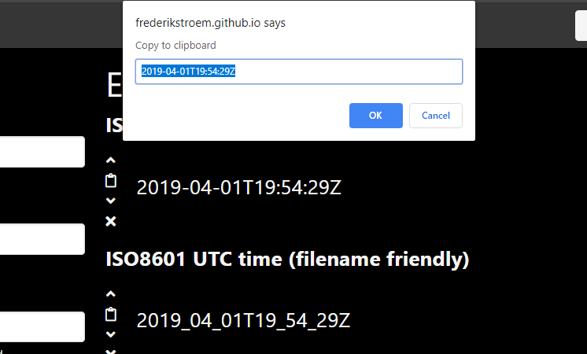
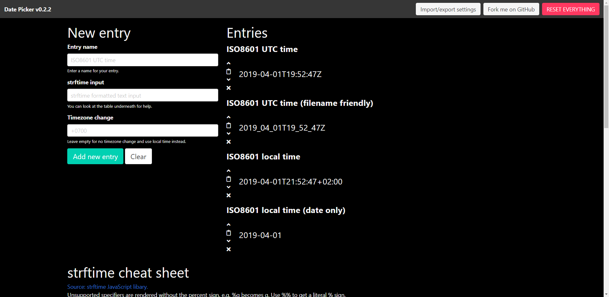

# Date Picker
A date picker to clipboard written in JavaScript, hosted on [GitHub Pages](https://frederikstroem.github.io/date-picker/).

## Sreenshots

## Libraries used
- [strftime](https://github.com/samsonjs/strftime)
- [Bulma](https://github.com/jgthms/bulma)
- [Font Awesome](https://github.com/FortAwesome/Font-Awesome)
